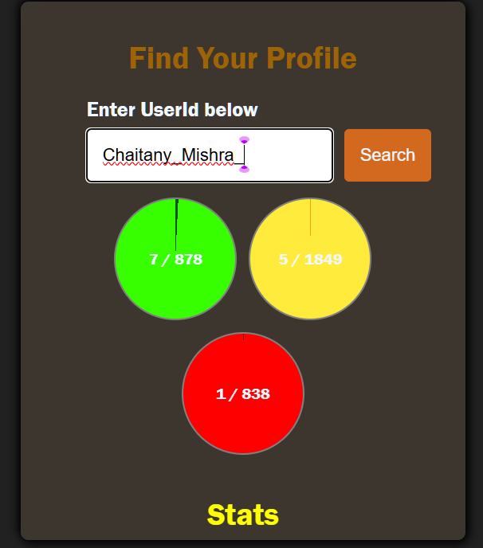

# 🔍 LeetCode Profile Finder

A sleek, JavaScript-based web application that allows users to fetch and display LeetCode profile data by simply entering a username. Built to demonstrate DOM manipulation, API integration, and clean UI design.

---

## 🚀 Live Demo

👉 [Live Project on GitHub](https://github.com/ChaitanyMishra/last365/tree/main/LeetCode-Profile-Finder)

---

## 📸 Screenshot



---

## 🧠 Features

- ✅ Fetch LeetCode user profile using public GraphQL API
- 📊 Displays number of problems solved by difficulty (Easy, Medium, Hard)
- 🏆 Contest rating, rank, and global percentile shown
- 🔍 Real-time data fetch on username entry
- 💻 Fully responsive design for desktop and mobile
- 🎯 Built using only HTML, CSS, and JavaScript (No frameworks!)

---

## 🛠️ Tech Stack

| Technology   | Purpose                        |
|--------------|--------------------------------|
| HTML5        | Markup                         |
| CSS3         | Styling                        |
| JavaScript   | DOM manipulation, API logic    |
| LeetCode API | Profile data source            |

---


## 🧪 How to Use

1. **Clone the Repository:**

   ```bash
   git clone https://github.com/ChaitanyMishra/last365.git

🤝 Connect with Me
🔗 GitHub: ChaitanyMishra

💼 LinkedIn: https://www.linkedin.com/in/chaitany-dev-hash/

📧 Email: mr.chetan105@gmail.com


## 📁 Project Structure

